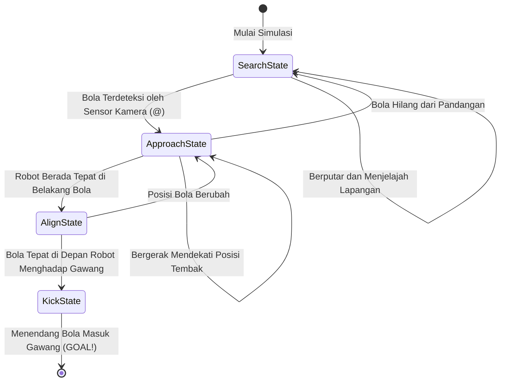
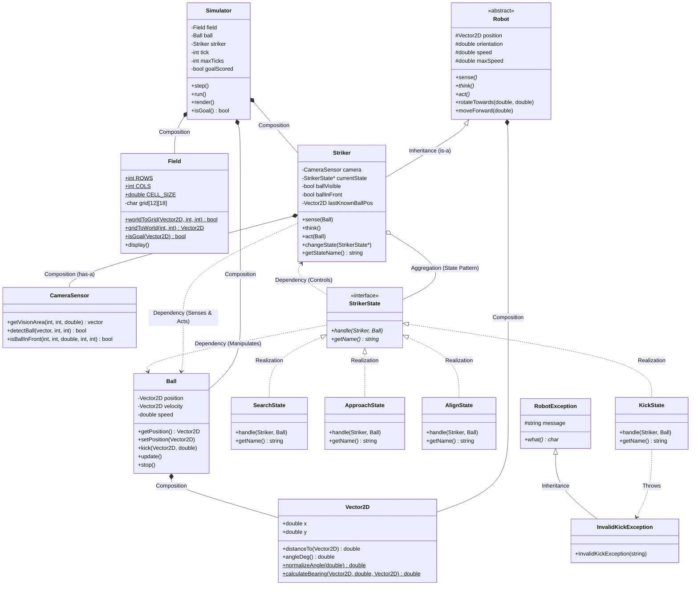

# MAINAN ROBOT - Simulasi AI Striker Robot Soccer (ICHIRO ITS)

Proyek simulasi robot soccer humanoid 2D berbasis terminal untuk robot Striker (Penyerang) otonom. Robot bertugas mencari posisi bola di lapangan, mendekati bola, mengatur sudut tembak, dan menendang bola hingga masuk ke gawang lawan.

---

## Fitur Utama

### Level 1: Core Simulation & OOP
- **Vector2D Helper**: Modul matematika 2D untuk menghitung jarak, bearing angle, dan normalisasi sudut -180° sampai 180° sesuai prinsip DRY.
- **Field ($9\text{m} \times 6\text{m}$)**: Representasi lapangan grid ASCII $18 \times 12$ petak ($1\text{ petak} = 0.5\text{m} \times 0.5\text{m}$) dengan gawang lawan (`#`).
- **Ball**: Objek bola dengan fisika deselerasi nyata ($3 \to 2 \to 1 \to 0\text{ m/tick}$).
- **Abstract Class Robot**: Kelas induk dengan enkapsulasi (getter/setter tervalidasi) dan pembatasan kecepatan maksimum 0.5 m/tick.

### Level 2: Sensor Kamera & Exception Handling
- **Camera Sensor (Vision Segitiga)**: Implementasi sensor kamera (Composition / HAS-A) dengan jangkauan pandang segitiga (tinggi 1.5m, alas 3.5m). Pembacaan bola dilakukan murni melalui sensor kamera tanpa membaca data global simulator.
- **Exception Handling**: Penanganan aksi tidak valid melalui try-catch (misalnya saat robot mencoba menendang bola yang belum berada di posisi depan melalui `InvalidKickException`).

### Level 3: Extra Features
- **Interactive User Input**: Input interaktif koordinat awal robot, sudut hadap, dan posisi bola saat program dijalankan.
- **File Konfigurasi (`config.txt`)**: Penentuan posisi awal Striker dan Bola melalui file teks.
- **State Pattern**: Pengelolaan alur perilaku Striker menggunakan State Pattern (`SearchState` -> `ApproachState` -> `AlignState` -> `KickState`).
- **Arah Tendangan**: Kemampuan eksekusi tendangan lurus maupun miring (diagonal).
- **Unit Testing**: Pengujian independen untuk kalkulasi matematika vektor dan fisika perlambatan bola.

---

## Panduan Kompilasi dan Eksekusi

Pastikan terminal berada di direktori `tugasweek1`.

### 1. Simulasi Utama
```bash
# Kompilasi
g++ -Iinclude src/Ball.cpp src/CameraSensor.cpp src/ConfigLoader.cpp src/Field.cpp src/Main.cpp src/Robot.cpp src/Simulator.cpp src/Striker.cpp src/StrikerState.cpp -o main.exe

# Menjalankan di Git Bash / Linux
./main.exe

# Menjalankan di CMD / PowerShell
main.exe
```

Saat program dijalankan, masukkan koordinat sesuai permintaan di terminal:
```text
Masukkan posisi Robot (x y): -1.5 0.0
Masukkan sudut hadap Robot (derajat): 0.0
Masukkan posisi Bola (x y): 1.0 -0.5
```

### 2. Unit Testing
```bash
g++ -Iinclude src/UnitTest.cpp src/Ball.cpp -o test.exe
./test.exe
```

---

## Arti Simbol Grid

| Simbol | Deskripsi |
|:---:|---|
| `R` | Robot Striker |
| `@` | Area jarak pandang sensor kamera segitiga (Field of View) |
| `O` | Bola |
| `#` | Gawang lawan di sisi kanan ($x = 4.5\text{m}$) |
| `.` | Area kosong lapangan |

---

## Alur State AI Striker



---

## Diagram Kelas (Arsitektur OOP)



---

## Pernyataan Penggunaan AI

AI digunakan sebagai asisten pemrograman untuk membantu:
- Penataan struktur modular C++ dan header `.hpp`.
- Perhitungan geometris area vision kamera segitiga.
- Pembuatan visualisasi diagram Mermaid pada dokumentasi.
Seluruh logika inti algoritma, validasi OOP, enkapsulasi, dan eksekusi program telah diverifikasi dan diuji sesuai spesifikasi tugas.
